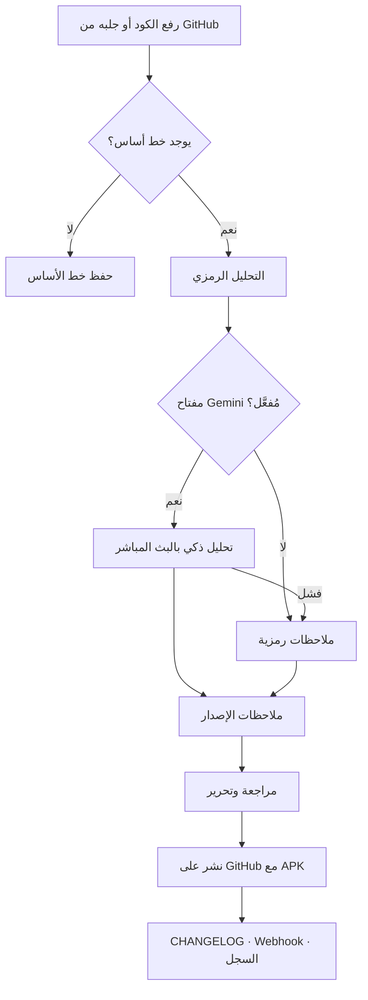
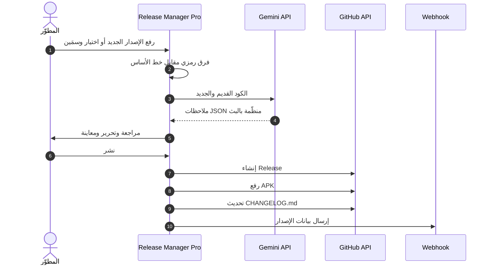
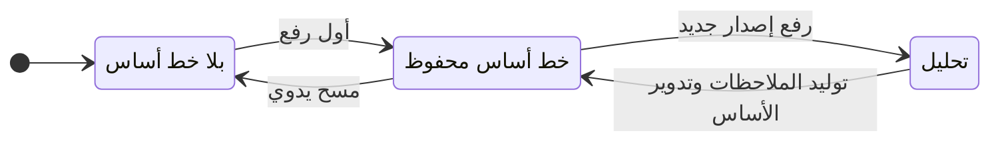
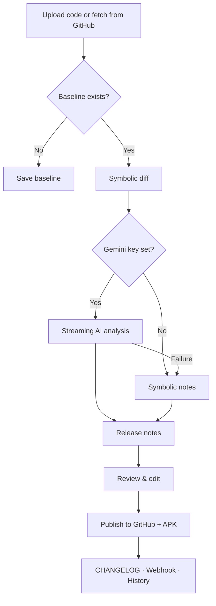
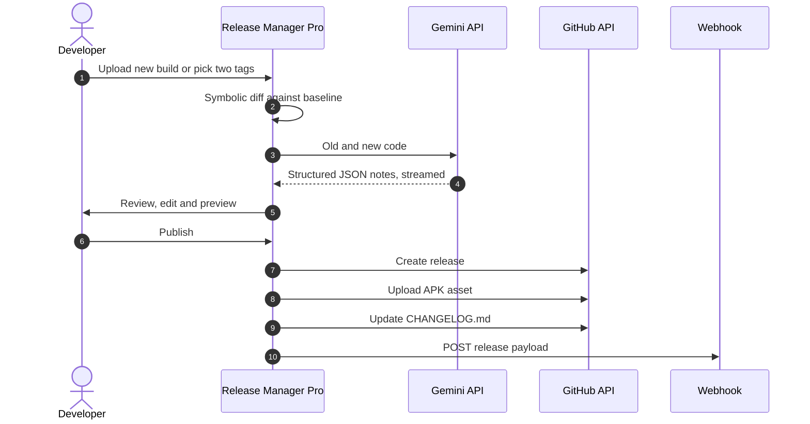
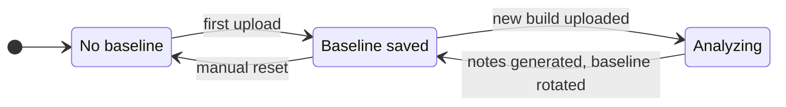

<a id="top"></a>

<div align="center">



<br>


<h3 dir="rtl">حلّل كودك · دع الذكاء الاصطناعي يكتب ملاحظات الإصدار · انشر على GitHub بضغطة واحدة</h3>
<p><i>Analyze your code · Let AI write the release notes · Ship to GitHub in one tap</i></p>

<table>
  <tr>
    <td align="center" width="140"><h2>0</h2><sub>خوادم<br>servers</sub></td>
    <td align="center" width="140"><h2>2</h2><sub>محركا تحليل<br>analysis engines</sub></td>
    <td align="center" width="140"><h2>3</h2><sub>أوضاع مقارنة<br>compare modes</sub></td>
    <td align="center" width="140"><h2>4</h2><sub>أنواع مشاريع<br>project types</sub></td>
    <td align="center" width="140"><h2>1</h2><sub>ضغطة للنشر<br>tap to ship</sub></td>
  </tr>
</table>

<a href="#arabic"><b>العربية</b></a>
&nbsp;·&nbsp;
<a href="#english"><b>English</b></a>

</div>

<br>

---

<a id="arabic"></a>

<div dir="rtl">

## فهرس المحتويات

- [نظرة عامة](#ar-overview)
- [المزايا الرئيسية](#ar-features)
- [كيف يعمل](#ar-how)
- [محرك التحليل من الداخل](#ar-engine)
- [التحليل الذكي بـ Gemini](#ar-ai)
- [البدء السريع](#ar-quickstart)
- [دليل الاستخدام التفصيلي](#ar-guide)
- [أنواع المشاريع المدعومة](#ar-types)
- [التكامل مع GitHub والصلاحيات](#ar-github)
- [الأتمتة: Webhook والتحديث التلقائي والقوالب](#ar-automation)
- [الأمان والخصوصية](#ar-security)
- [تحويله إلى تطبيق أندرويد](#ar-android)
- [استكشاف الأخطاء وإصلاحها](#ar-troubleshooting)
- [الأسئلة الشائعة](#ar-faq)
- [خارطة الطريق](#ar-roadmap)
- [المساهمة](#ar-contributing)
- [المؤلف والرخصة](#ar-license)

<a id="ar-overview"></a>

## نظرة عامة

**Release Manager Pro** أداة ويب احترافية تعمل بالكامل داخل المتصفح، صُمّمت لتختصر أكثر مراحل دورة الإصدار استهلاكًا للوقت: **فهم ما تغيّر فعلًا، ثم شرحه للمستخدمين بلغة يفهمونها، ثم نشره.**

ترفع كود الإصدار الجديد أو تجلبه مباشرة من GitHub، فيقارنه التطبيق بالإصدار السابق عبر محرّكين متكاملين: **محرك تحليل رمزي** دقيق يعمل دائمًا، و**محرك ذكاء اصطناعي** مبني على Google Gemini. النتيجة ملاحظات إصدار عربية جاهزة تُنشر كإصدار رسمي على GitHub مع ملف APK، ثم يُحدَّث سجل التغييرات ويُبلَّغ فريقك تلقائيًا. كل ذلك دون خادم ودون تثبيت، ولا تخرج بياناتك من جهازك إلا إلى الخدمات التي تختارها أنت.

> [!TIP]
> صُمّم التطبيق بعقلية **العربية أولًا**: واجهة RTL أصيلة، ومحرك يلتقط نصوص الواجهة العربية تحديدًا، وملاحظات إصدار بعربية فصيحة مكتوبة من منظور المستخدم لا المبرمج.

### لماذا Release Manager Pro؟

| المشكلة المعتادة | كيف يحلها Release Manager Pro |
|---|---|
| كتابة ملاحظات الإصدار يدويًا تستهلك الوقت وتسقط منها تفاصيل | توليد تلقائي من الفرق الفعلي بين الإصدارين |
| ملاحظات تقنية مليئة بأسماء دوال لا يفهمها المستخدم | الذكاء الاصطناعي يكتب بلغة المستخدم وبلا مصطلحات برمجية |
| تنقّل مرهق بين المحرر وGitHub ورفع APK وتحديث CHANGELOG | مسار واحد متصل: تحليل ← مراجعة ← نشر ← أتمتة ما بعد النشر |
| أدوات تتطلب خوادم وحسابات واشتراكات | صفحة ويب مستقلة بلا خادم، تعمل حتى كتطبيق أندرويد |
| ضياع تاريخ الإصدارات بين الأجهزة | سجل زمني محلي، ومزامنة من GitHub، ونسخ احتياطي JSON |

<a id="ar-features"></a>

## المزايا الرئيسية

### إدارة مشاريع متعددة
- عدد غير محدود من المشاريع، لكل منها: المستودع، ونوع المشروع، ورابط التحديث، واسم APK، ورابط Webhook.
- اختيار المستودع من قائمة مستودعاتك مباشرة (أحدث 100 مستودع) بدل كتابته يدويًا.
- اختبار اتصال فوري يتحقق من صلاحية التوكن ويعرض حالة المستودع: عام أو خاص.
- **توكن GitHub عام** موحّد لكل المشاريع مع إمكانية تخصيص توكن لمشروع بعينه، وترحيل تلقائي لأي توكن قديم إلى التخزين المُشوَّش. <sub>`v2.6`</sub>
- مؤشرات حيّة في الشريط العلوي لحالة الاتصال بـ GitHub وتفعيل Gemini.

### محرك التحليل الرمزي
- يعمل دائمًا، حتى دون إنترنت ودون مفتاح ذكاء اصطناعي.
- يستخرج بنية كل ملف: الدوال، والكلاسات، والثوابت، وعناصر HTML، ومسارات API، والاستيرادات، ونقاط الاتصال الشبكي، وأقسام الكود، ونصوص الواجهة، ومتغيرات CSS.
- يكشف **الدوال المعدَّلة** عبر بصمة لمحتواها، و**الدوال المعاد تسميتها** عبر خوارزمية تشابه نصي.
- يصنّف أثر التغييرات في كل ملف: عالٍ، متوسط، أو بسيط.

### التحليل الذكي بـ Gemini
- يرسل الإصدارين إلى Gemini ويطلب ملاحظات بعربية فصيحة من منظور المستخدم.
- مخرجات منظَّمة مضمونة البنية عبر JSON Schema: إضافات، تحسينات، إصلاحات، إزالات، وملخص.
- بث مباشر (Streaming) مع سجل مراحل ومؤقت حي، فترى التحليل وهو يُكتب.
- عند أي فشل يعود تلقائيًا إلى المحرك الرمزي، فلا يتوقف مسار الإصدار أبدًا.

### ثلاثة أوضاع للمقارنة

| الوضع | متى تستخدمه | كيف يعمل |
|---|---|---|
| **خط الأساس (Baseline)** — الافتراضي | دورة إصدار مستمرة | أول رفع يُحفظ خطَّ أساس، وكل تحليل لاحق يُقارَن به ثم يصبح هو الأساس الجديد |
| **المقارنة المباشرة** | مقارنة أي إصدارين | ارفع ملفات «قبل» و«بعد» يدويًا دون المساس بخط الأساس |
| **الجلب من GitHub** | الكود موجود في المستودع | قارن بين وسمَين (Tags) أو فرعَين (Branches) وتُجلب الملفات تلقائيًا |

### مولّد ملاحظات الإصدار
- وسم وعنوان ووصف Markdown جاهزة، مع نسخ كل عنصر منفردًا أو الكل دفعة واحدة.
- محرر Markdown مع معاينة فورية.
- تصدير الملاحظات كملف Markdown.
- **قوالب مخصصة لكل مشروع** بمتغيرات ديناميكية تُضاف أعلى الملاحظات.
- **اقتراح ذكي لرقم الإصدار التالي** وفق SemVer (رفع `minor` عند وجود ميزات جديدة، و`patch` للإصلاحات والتحسينات) يُطبَّق بضغطة.

### النشر على GitHub
- إنشاء إصدار رسمي (Release) مع خيارَي **مسودة** و**إصدار تجريبي**.
- رفع APK كملف مرفق (Asset) مع شريط تقدم يعرض النسبة والحجم والسرعة والوقت المتبقي.
- تسمية موحّدة لملف APK تلقائيًا: اسم التطبيق متبوعًا برقم الإصدار، مثل `my-app-v1.2.0.apk`.

### أتمتة ما بعد النشر
- **تحديث CHANGELOG.md** في مستودعك: يُضاف الإصدار الجديد مع تاريخه أعلى الملف، ويُنشأ الملف إن لم يوجد.
- **إشعار Webhook** بطلب POST إلى Slack أو Discord أو n8n أو Zapier أو أي خادم.
- **وثيقة معمارية تُولَّد تلقائيًا** وتُنشر في مستودعك: نظرة عامة يكتبها الذكاء الاصطناعي، وإحصاءات الكود، والدوال الرئيسية، ومخطط التخزين، ونقاط الاتصال الخارجية، والقيود التقنية. <sub>`v2.6`</sub>

### السجل والمزامنة
- خط زمني لكل مشروع يعرض عدد الإضافات والحذف والملاحظات الكاملة لكل إصدار.
- مزامنة آخر الإصدارات المنشورة من GitHub ودمجها في السجل دون تكرار.

### الإعدادات والبيانات
- اختيار نموذج Gemini والحد الأقصى للحروف المرسلة لكل ملف.
- **نسخ احتياطي كامل** (المشاريع، والإعدادات، والسجل، والقوالب) في ملف JSON، واستيراد آمن يدمج الجديد دون الكتابة فوق الموجود.
- ترحيل تلقائي من نماذج Gemini المتوقفة إلى النموذج الافتراضي.
- **تنبيه بالتحديثات**: عند الفتح يقرأ ملف `version.json` ويعرض شريطًا إن توفّر إصدار أحدث.

<a id="ar-how"></a>

## كيف يعمل

<div dir="ltr">



</div>

### رحلة الإصدار كاملة

<div dir="ltr">



</div>

<a id="ar-engine"></a>

## محرك التحليل من الداخل

### ما يُستخرج من كل لغة

| العنصر | HTML | JS / TS | Python | JSON |
|---|:---:|:---:|:---:|:---:|
| الدوال (عادية، سهمية، غير متزامنة) | ✓ | ✓ | ✓ | — |
| بصمة محتوى الدوال | ✓ | ✓ | ✓ | — |
| الكلاسات | — | — | ✓ | — |
| الثوابت (`UPPER_CASE`) | ✓ | ✓ | ✓ | ✓ |
| معرّفات عناصر الواجهة | ✓ | — | — | — |
| مسارات API (Flask / FastAPI) | — | — | ✓ | — |
| الاستيرادات (`import` / `require` / `from`) | ✓ | ✓ | ✓ | — |
| نقاط الاتصال (`fetch`) | ✓ | ✓ | — | — |
| أقسام الكود (تعليقات فاصلة) | ✓ | ✓ | ✓ | — |
| نصوص الواجهة العربية | ✓ | ✓ | ✓ | — |
| متغيرات CSS | ✓ | ✓ | — | — |

### الخوارزميات

| الآلية | التفاصيل |
|---|---|
| **كشف الدوال المعدَّلة** | بصمة `djb2` لأول 10 أسطر من جسم كل دالة؛ تغيُّر البصمة مع بقاء الاسم يعني تعديلًا في المنطق |
| **كشف إعادة التسمية** | تشابه Jaccard على الثنائيات الحرفية (bigrams) بين الدوال المحذوفة والمضافة، بعتبة `0.35` |
| **تصنيف الأثر** | **عالٍ**: أكثر من 8 تغييرات هيكلية · **متوسط**: أكثر من 2، أو أكثر من 40 سطرًا · **بسيط**: ما عدا ذلك |
| **كشف رقم الإصدار** | `APP_VERSION`، أو `"version"` في JSON، أو `version =` و`__version__` في Python، والافتراضي `0.0.0` |
| **دورة خط الأساس** | يُحفظ الكود مقتطعًا وفق حد الحروف، ويُستبدل بعد كل تحليل ناجح، ويُضاف الإصدار إلى السجل |

<div dir="ltr">



</div>

<a id="ar-ai"></a>

## التحليل الذكي بـ Gemini

يُرسل التطبيق الإصدارين إلى Gemini مع تعليمات صارمة:

1. الكتابة حصرًا من منظور المستخدم: ما يراه ويشعر به.
2. عدم ذكر أسماء ملفات أو دوال أو متغيرات أو مصطلحات برمجية.
3. التحديد والوضوح: «أُضيف زر لنسخ النص بضغطة واحدة» بدل «أُضيفت ميزة جديدة».
4. رصد تغييرات الألوان والتصميم والأزرار والنصوص وتجربة الاستخدام.
5. ترك القسم فارغًا إن لم يوجد فيه تغيير حقيقي.
6. الإجابة بـ JSON صحيح فقط.

وتُفرض البنية عبر `responseSchema` مع `temperature: 0.1` لأقصى ثبات، ويُعرض الرد حيًّا عبر البث (SSE).

<div dir="ltr">

```json
{
  "additions": ["..."],
  "updates":   ["..."],
  "fixes":     ["..."],
  "removals":  ["..."],
  "summary":   "..."
}
```

</div>

### النماذج المتاحة

| النموذج | الوصف |
|---|---|
| `gemini-3.6-flash` | الافتراضي: الأحدث والأسرع |
| `gemini-3.5-flash` | بديل مجاني موثوق |
| `gemini-3.5-flash-lite` | الأسرع والأخف استهلاكًا للحصة |
| `gemini-2.5-flash` | جيل سابق مستقر |

### حد الحروف المرسلة لكل ملف

| الحد | الاستخدام |
|---|---|
| 30,000 حرف | سريع جدًا، للمشاريع الصغيرة |
| **60,000 حرف** | **الموصى به** |
| 100,000 حرف | شامل وأبطأ، للملفات الكبيرة |

### مثال على الناتج

<div dir="ltr">

```markdown
### 🆕 إضافات جديدة
- أصبح بإمكانك مقارنة إصدارين مباشرة من المستودع دون رفع أي ملف
- زر جديد لنسخ ملاحظات الإصدار كاملة بضغطة واحدة

### 📝 تحسينات وتحديثات
- شريط تقدم أوضح أثناء رفع ملف التطبيق يعرض السرعة والوقت المتبقي

### 🔧 إصلاحات
- لم تعد الإعدادات تُفقد عند إعادة فتح التطبيق

### 📦 تفاصيل الإصدار
- الإصدار: v2.6.0 (كان v2.5.0)
- الملخص: تحديث يركّز على سرعة النشر وسهولة المقارنة
```

</div>

> [!NOTE]
> التحليل الذكي يحتاج إلى نسخة من الكود القديم. إن كان خط الأساس محفوظًا من إصدار قديم لا يتضمن الكود، فسيعمل التحليل الذكي بدءًا من الإصدار التالي، أو امسح خط الأساس وارفع الملفات من جديد.

<a id="ar-quickstart"></a>

## البدء السريع

1. **شغّل التطبيق**: افتحه في أي متصفح حديث أو استضفه على GitHub Pages. لا تثبيت ولا بناء ولا اعتماديات.
2. **أنشئ توكن GitHub** من [إعدادات المطوّر](https://github.com/settings/personal-access-tokens) (يُفضَّل Fine-grained مع الصلاحيات في [هذا الجدول](#ar-github)).
3. **(اختياري) احصل على مفتاح Gemini مجانًا** من [Google AI Studio](https://aistudio.google.com) عبر: *Get API key* ← *Create API key*، ثم الصقه في **الإعدادات**.
4. **أضف مشروعًا** من تبويب **المشاريع**: الاسم، والنوع، والمستودع، وجرّب **اختبار الاتصال**.
5. **ارفع الإصدار الحالي** في تبويب **التحليل**؛ سيُحفظ كخط أساس.
6. **عند إصدارك التالي**: ارفع الملفات الجديدة ← **تحليل وإنشاء ملاحظات الإصدار** ← راجعها في تبويب **الإصدار** ← **نشر الإصدار على GitHub**.

> [!IMPORTANT]
> لكي يُكتشف رقم الإصدار تلقائيًا، عرّف في كودك أحد الأنماط التالية: `const APP_VERSION = 'x.y.z'` أو حقل `"version"` أو `__version__`.

<a id="ar-guide"></a>

## دليل الاستخدام التفصيلي

<details>
<summary><b>المشاريع</b>: إضافة مشاريعك وإدارتها</summary>

<br>

- **إضافة مشروع**: الاسم، والنوع، والتوكن (أو التوكن العام)، والمالك، والمستودع.
- **زر القائمة** بجوار حقل المستودع يعرض مستودعاتك لتختار منها.
- **رابط version.json**: لتفعيل تنبيه التحديثات.
- **اسم APK**: يُستخدم لتسمية الملف المرفق تلقائيًا.
- **Webhook**: رابط يُستدعى بعد كل نشر ناجح.
- كل بطاقة مشروع تعرض آخر إصدار وحالة خط الأساس، مع أزرار التعديل والحذف.

</details>

<details>
<summary><b>التحليل</b>: قلب التطبيق</summary>

<br>

- اختر المشروع لترى آخر إصدار وحالة خط الأساس وجاهزية Gemini.
- **الوضع الافتراضي**: اسحب ملفات المشروع وأفلتها ثم اضغط **تحليل**.
- **المقارنة المباشرة**: فعّلها لتظهر منطقة «الإصدار القديم» وارفع الجانبين.
- **الجلب من GitHub**: اختر «وسمَين» أو «فرعَين» واكتب القيمتين، مثل `v1.0.0` و`v1.1.0` أو `main` و`develop`.
- تظهر النتائج لكل ملف مع شارات الأثر، وتتضمن الإضافات والحذف والتعديل وإعادة التسمية ومتغيرات CSS ونصوص الواجهة.
- يعرض سجل مراحل الذكاء الاصطناعي تقدّم التحليل خطوة بخطوة مع مؤقت حي ومقتطف من الرد المباشر.

</details>

<details>
<summary><b>الإصدار</b>: المراجعة والنشر</summary>

<br>

- الوسم والعنوان والوصف، مع أزرار نسخ منفردة و**نسخ الكل** و**تصدير Markdown**.
- **اقتراح رقم الإصدار**: قارن الحالي بالمقترح وطبّقه بضغطة.
- محرر الوصف مع زرَّي **تعديل** و**معاينة**.
- خيارا **مسودة** و**تجريبي** قبل النشر.
- **APK اختياري**: اسحبه ليُرفع كملف مرفق مع شريط تقدم مفصّل.
- بعد النشر: زر **تحديث CHANGELOG.md**، وحالة إرسال الـ Webhook.

</details>

<details>
<summary><b>التاريخ</b>: الخط الزمني للإصدارات</summary>

<br>

- اختر مشروعًا لعرض إصداراته مرتبة زمنيًا مع عدّاد الإضافات والحذف.
- وسّع أي إصدار لقراءة ملاحظاته كاملة.
- **مزامنة من GitHub** تجلب الإصدارات المنشورة وتدمجها دون تكرار.

</details>

<details>
<summary><b>الإعدادات</b>: الذكاء الاصطناعي والبيانات</summary>

<br>

- **مفتاح Gemini**: حفظ، واختبار اتصال، ومسح.
- **توكن GitHub العام**: حفظ واختبار ومسح، ويُستخدم لكل مشروع لا يملك توكنًا خاصًا.
- **النموذج وحد الحروف**.
- **القوالب**: اختر مشروعًا واكتب قالبه.
- **النسخ الاحتياطي**: تصدير واستيراد JSON.

</details>

<a id="ar-types"></a>

## أنواع المشاريع المدعومة

| النوع | مصدر رقم الإصدار | الاستخدام النموذجي |
|---|---|---|
| **HTML واحد** | `const APP_VERSION = 'x.y.z'` | تطبيق ويب في صفحة واحدة، أو تطبيق أندرويد مغلّف |
| **HTML + Python** | `APP_VERSION` أو `__version__` | واجهة ويب مع خادم أو سكربتات Python |
| **Node.js** | `"version"` في ملف الحزمة | تطبيقات ومكتبات JavaScript وTypeScript |
| **Python** | `version =` أو `__version__` | أدوات وخدمات Python |

> [!NOTE]
> يحلّل المحرك كل الامتدادات المدعومة أيًّا كان نوع المشروع: HTML وHTM وJS وTS وPython وJSON، ويقبل TXT دون تحليل هيكلي.

<a id="ar-github"></a>

## التكامل مع GitHub والصلاحيات

| العملية | نقطة الاتصال | صلاحية Fine-grained |
|---|---|---|
| التحقق من التوكن | `GET /user` | — |
| قائمة مستودعاتك | `GET /user/repos` | Metadata: Read |
| معلومات المستودع | `GET /repos/{owner}/{repo}` | Metadata: Read |
| شجرة الملفات لوسم أو فرع | `GET /repos/{owner}/{repo}/git/trees/{ref}` | Contents: Read |
| محتوى ملف | `GET /repos/{owner}/{repo}/contents/{path}` | Contents: Read |
| سجل الإصدارات | `GET /repos/{owner}/{repo}/releases` | Contents: Read |
| إنشاء إصدار | `POST /repos/{owner}/{repo}/releases` | **Contents: Write** |
| رفع APK | `POST uploads.github.com/.../assets` | **Contents: Write** |
| CHANGELOG والوثيقة المعمارية | `PUT /repos/{owner}/{repo}/contents/{path}` | **Contents: Write** |

> [!TIP]
> **التوكن المثالي**: Fine-grained، مقيّد بالمستودعات التي تديرها فقط، بصلاحية `Contents: Read and write` و`Metadata: Read`، مع تاريخ انتهاء. أما التوكن الكلاسيكي فيحتاج `repo` للمستودعات الخاصة أو `public_repo` للعامة.

<a id="ar-automation"></a>

## الأتمتة: Webhook والتحديث التلقائي والقوالب

### بيانات الـ Webhook

بعد كل نشر ناجح يُرسل التطبيق طلب `POST` بهذه البنية:

<div dir="ltr">

```json
{
  "project": "My App",
  "version": "v2.6.0",
  "title": "My App — تحديث v2.6.0",
  "url": "https://github.com/owner/repo/releases/tag/v2.6.0",
  "repo": "owner/repo",
  "timestamp": "2026-09-24T10:00:00.000Z"
}
```

</div>

> [!WARNING]
> تتوقع Slack حقل `text` وDiscord حقل `content`، لذا مرّر الطلب عبر وسيط يحوّل البنية (n8n أو Make أو Zapier أو Cloudflare Worker). ولأن الطلب يصدر من المتصفح، يجب أن يسمح الخادم المستقبِل بـ CORS، أو شغّل التطبيق داخل غلاف أندرويد حيث يُتجاوز CORS افتراضيًا.

### ملف التحديث التلقائي

استضف ملفًا بهذه البنية وضع رابطه في إعدادات المشروع:

<div dir="ltr">

```json
{
  "version": "2.6.0",
  "release_url": "https://github.com/owner/repo/releases/latest"
}
```

</div>

للرابط الخام من GitHub استخدم الصيغة: `https://raw.githubusercontent.com/{owner}/{repo}/main/version.json`

### قوالب ملاحظات الإصدار

| المتغير | القيمة |
|---|---|
| `{{version}}` | رقم الإصدار الجديد |
| `{{project}}` | اسم المشروع |
| `{{date}}` | تاريخ اليوم بالتنسيق العربي |
| `{{summary}}` | السطر الأول من الملاحظات |

<div dir="ltr">

```markdown
## {{project}} — الإصدار {{version}}
صدر بتاريخ {{date}}. شكرًا لكل من ساهم في هذا التحديث.
```

</div>

<a id="ar-security"></a>

## الأمان والخصوصية

| الجانب | التفاصيل |
|---|---|
| **بلا خادم** | لا توجد خوادم وسيطة، وكل البيانات في التخزين المحلي للمتصفح |
| **المفاتيح والتوكنات** | تُخزَّن مُشوَّشة بـ XOR + Base64، وهذا **حماية من الاطلاع العرضي وليس تشفيرًا قويًا** |
| **الحماية من XSS** | كل نص ديناميكي يُهرَّب قبل العرض، بما فيه معاينة Markdown |
| **الوجهات الشبكية** | GitHub API، وGemini API، وروابط `version.json` والـ Webhook التي تحددها أنت، والخطوط والأيقونات من CDN |
| **الكود المرسل للذكاء الاصطناعي** | يُرسل فقط عند تفعيل مفتاح Gemini، ومقتطعًا وفق حد الحروف الذي تختاره |

> [!CAUTION]
> - لا تستخدم التطبيق على جهاز مشترك، وألغِ توكناتك فورًا إن فُقد الجهاز.
> - **ملف النسخة الاحتياطية** قد يتضمن بيانات حساسة؛ احفظه في مكان خاص.
> - لا تحلّل كودًا يحتوي أسرارًا مكشوفة، وراجع شروط Gemini API الخاصة باستخدام البيانات في الطبقة المجانية.

### مخطط التخزين المحلي

| المفتاح | المحتوى |
|---|---|
| `rm2_projects` | قائمة المشاريع وإعداداتها |
| `rm2_bl_{id}` | خط الأساس: الإصدار، والبنية المستخرجة، والكود المقتطع |
| `rm2_hist_{id}` | سجل الإصدارات |
| `rm2_tpl_{id}` | قالب ملاحظات المشروع |
| `rm2_arch_{id}` | بيانات الوثيقة المعمارية |
| `rm2_gk` · `rm2_ght` | مفتاح Gemini والتوكن العام (مُشوَّشان) |
| `rm2_model` · `rm2_maxchars` | إعدادات التحليل الذكي |

> [!NOTE]
> سعة التخزين المحلي في المتصفح نحو 5 إلى 10 ميغابايت. مع المشاريع الكبيرة اختر حد حروف أقل، وصدّر نسخة احتياطية دوريًا.

<a id="ar-android"></a>

## تحويله إلى تطبيق أندرويد

يمكن تغليف التطبيق كـ APK مستقل عبر مكتبة [**WebToApp**](https://github.com/shiaho777/web-to-app) مباشرة من الهاتف ودون حاسوب:

1. ثبّت WebToApp من [صفحة إصداراتها](https://github.com/shiaho777/web-to-app/releases) (يتطلب Android 6.0 أو أحدث).
2. أنشئ تطبيقًا من نوع **HTML** واستورد صفحة Release Manager Pro.
3. اترك **تجاوز CORS** مفعّلًا (وهو افتراضي للصفحات الثابتة)، فيعمل الـ Webhook مع أي خادم.
4. فعّل **اعتراض تنزيلات blob** كي يعمل تصدير Markdown والنسخ الاحتياطي.
5. اضغط **Build APK**، ثم استخدم Release Manager Pro نفسه لنشر إصداراته.

<a id="ar-troubleshooting"></a>

## استكشاف الأخطاء وإصلاحها

| الرسالة | السبب المحتمل | الحل |
|---|---|---|
| مفتاح غير صالح أو API غير مفعّل | خطأ 401 أو 403 من Gemini | فعّل Generative Language API في Google Cloud Console، أو أنشئ مفتاحًا جديدًا من AI Studio |
| تجاوزت الحد اليومي المجاني | خطأ 429 | انتظر تجدد الحصة، أو استخدم `flash-lite`، أو خفّض حد الحروف |
| النموذج متوقف | نموذج أُوقف رسميًا | اختر نموذجًا آخر من الإعدادات |
| تعذّر الوصول | انقطاع الشبكة، أو حجب، أو API غير مفعّل | تحقق من الاتصال والشبكة، ثم اختبر المفتاح من الإعدادات |
| `Validation Failed` عند النشر | الوسم مستخدم في إصدار سابق | غيّر الوسم أو احذف الإصدار القديم |
| تم الإصدار لكن فشل رفع APK | صلاحيات، أو شبكة، أو اسم ملف مكرر | تحقق من `Contents: Write` ثم ارفعه يدويًا من صفحة الإصدار |
| `Resource not accessible by personal access token` | صلاحيات التوكن ناقصة | امنح التوكن `Contents: Read and write` |
| Webhook فشل | CORS أو بنية غير متوقعة | استخدم وسيطًا، أو شغّل التطبيق داخل غلاف أندرويد |
| الجلب من GitHub لا يجد ملفات | وسم أو فرع خاطئ، أو امتدادات غير مدعومة | تأكد من الاسم، فالمدعوم: HTML وJS وTS وPython وJSON |

<a id="ar-faq"></a>

## الأسئلة الشائعة

<details>
<summary><b>هل أحتاج إلى خادم أو حساب مدفوع؟</b></summary>
<br>
لا. التطبيق صفحة ويب مستقلة، وGemini يوفّر طبقة مجانية، وGitHub مجاني.
</details>

<details>
<summary><b>هل يعمل دون مفتاح Gemini؟</b></summary>
<br>
نعم. يعمل المحرك الرمزي دائمًا ويولّد ملاحظات تقنية دقيقة، ويضيف Gemini الصياغة البشرية من منظور المستخدم.
</details>

<details>
<summary><b>هل يُرسل كودي إلى أي جهة؟</b></summary>
<br>
فقط إلى Gemini وعند تفعيل المفتاح، وإلى GitHub عند النشر أو الجلب. لا توجد أي خوادم أخرى.
</details>

<details>
<summary><b>هل يدعم المستودعات الخاصة؟</b></summary>
<br>
نعم، بتوكن يملك صلاحية الوصول إليها.
</details>

<details>
<summary><b>كيف أنقل بياناتي إلى جهاز آخر؟</b></summary>
<br>
من الإعدادات: <b>تصدير نسخة احتياطية</b> على الجهاز الأول، ثم <b>استيراد</b> على الثاني. الاستيراد يدمج دون حذف الموجود.
</details>

<details>
<summary><b>لماذا لا يقترح رفع الرقم الرئيسي (major)؟</b></summary>
<br>
التغييرات الجذرية قرار منتج لا يُستنتج آليًا بأمان، لذا يقترح التطبيق <code>minor</code> أو <code>patch</code> فقط، ويمكنك تعديل الوسم يدويًا.
</details>

<a id="ar-roadmap"></a>

## خارطة الطريق

**مُنجز**
- [x] محرك تحليل رمزي متعدد اللغات مع كشف التعديل وإعادة التسمية
- [x] تحليل ذكي منظّم بالبث المباشر عبر Gemini
- [x] ثلاثة أوضاع للمقارنة، منها الجلب من الوسوم والفروع
- [x] نشر الإصدارات مع رفع APK وشريط تقدم
- [x] CHANGELOG وWebhook وقوالب واقتراح رقم الإصدار
- [x] توكن GitHub عام وترحيل التوكنات تلقائيًا
- [x] توليد الوثيقة المعمارية تلقائيًا

**مقترح للإصدارات القادمة**
- [ ] الانتقال إلى IndexedDB مع ترحيل تلقائي للمخطط لتجاوز حدود السعة
- [ ] تشفير حقيقي للمفاتيح عبر Web Crypto (AES-GCM) بكلمة مرور رئيسية
- [ ] دعم PWA كامل للعمل دون اتصال
- [ ] ملاحظات إصدار ثنائية اللغة (عربي / إنجليزي) في طلب واحد
- [ ] كشف التغييرات الجذرية واقتراح `major`
- [ ] عارض فروقات مرئي سطرًا بسطر
- [ ] دعم GitLab وGitea
- [ ] قراءة رسائل Conventional Commits وإدراجها في الملاحظات
- [ ] مزوّدو ذكاء اصطناعي إضافيون قابلون للاختيار
- [ ] نمط سطر أوامر أو GitHub Action لتوليد الملاحظات داخل CI

<a id="ar-contributing"></a>

## المساهمة

المساهمات مرحّب بها. للحفاظ على فلسفة المشروع:

1. انسخ المستودع (Fork) وأنشئ فرعًا باسم واضح مثل `feat/visual-diff`.
2. حافظ على مبدأ **بلا بناء وبلا اعتماديات**: HTML وCSS وJavaScript خالصة.
3. احترم **RTL أولًا**: خصائص منطقية، ونصوص عربية سليمة، وتجربة ممتازة على الجوال.
4. غلّف كل طلب شبكي بمعالجة أخطاء مع بديل لائق.
5. هرّب كل نص ديناميكي قبل إدراجه في الواجهة.
6. حدّث `APP_VERSION` وفق [SemVer](https://semver.org) واكتب الرسائل بصيغة [Conventional Commits](https://www.conventionalcommits.org).
7. افتح Pull Request يشرح التغيير ولقطات الشاشة إن وُجدت.

<a id="ar-license"></a>

## المؤلف والرخصة

صُمّم وطُوِّر بواسطة **ساجد العبادلة** — [@Dev-saged](https://github.com/Dev-saged).

لم تُضف رخصة مفتوحة المصدر إلى المستودع بعد؛ لذا فجميع الحقوق محفوظة للمؤلف حتى إضافتها.

<a href="#top">العودة للأعلى ↑</a>

</div>

---

<a id="english"></a>

## Table of Contents

- [Overview](#en-overview)
- [Key Features](#en-features)
- [How It Works](#en-how)
- [Inside the Analysis Engine](#en-engine)
- [AI Analysis with Gemini](#en-ai)
- [Quick Start](#en-quickstart)
- [Detailed User Guide](#en-guide)
- [Supported Project Types](#en-types)
- [GitHub Integration & Permissions](#en-github)
- [Automation: Webhooks, Auto-Update & Templates](#en-automation)
- [Security & Privacy](#en-security)
- [Packaging as an Android App](#en-android)
- [Troubleshooting](#en-troubleshooting)
- [FAQ](#en-faq)
- [Roadmap](#en-roadmap)
- [Contributing](#en-contributing)
- [Author & License](#en-license)

<a id="en-overview"></a>

## Overview

**Release Manager Pro** is a professional, browser-only web tool that removes the most time-consuming part of every release cycle: **understanding what actually changed, explaining it to users in words they understand, and shipping it.**

Upload your new build or pull it straight from GitHub. The app compares it against the previous version through two complementary engines: a precise **symbolic analysis engine** that always runs, and an **AI engine** powered by Google Gemini. The result is a polished set of release notes, published as an official GitHub Release with your APK attached, followed by an updated changelog and a team notification. No server, no installation, and your data never leaves your device except to the services you choose.

> [!TIP]
> Built **Arabic-first**: a native RTL interface, an engine that specifically captures Arabic UI strings, and release notes written in clear Modern Standard Arabic from the user's perspective, not the developer's.

### Why Release Manager Pro?

| The usual pain | How Release Manager Pro solves it |
|---|---|
| Hand-writing release notes is slow and details get lost | Notes are generated from the real diff between versions |
| Technical notes full of function names users don't understand | AI writes in user language, with zero code jargon |
| Juggling the editor, GitHub, APK uploads and CHANGELOG edits | One continuous flow: analyze → review → publish → post-publish automation |
| Tools that demand servers, accounts and subscriptions | A standalone serverless web page that even runs as an Android app |
| Release history scattered across devices | Local timeline, GitHub sync, and JSON backups |

<a id="en-features"></a>

## Key Features

### Multi-project management
- Unlimited projects, each with its own repository, project type, update URL, APK name and webhook.
- Pick the repository from your own list (100 most recently updated) instead of typing it.
- Instant connection test that validates the token and shows repository visibility.
- **Global GitHub token** shared by all projects, with optional per-project override and automatic migration of legacy tokens into obfuscated storage. <sub>`v2.6`</sub>
- Live header indicators for GitHub connectivity and Gemini status.

### Symbolic analysis engine
- Always on, even offline and without an AI key.
- Extracts each file's structure: functions, classes, constants, UI element IDs, API routes, imports, network endpoints, code sections, UI strings and CSS custom properties.
- Detects **modified functions** via content fingerprints and **renamed functions** via string similarity.
- Rates the impact of each file's changes: high, medium or low.

### AI analysis with Gemini
- Sends both versions to Gemini and asks for user-facing release notes.
- Guaranteed structured output via JSON Schema: additions, updates, fixes, removals and a summary.
- Real-time streaming with a step log and live timer, so you watch the notes being written.
- Any failure falls back to the symbolic engine automatically; the release flow never stalls.

### Three comparison modes

| Mode | When to use it | How it works |
|---|---|---|
| **Baseline** (default) | Continuous release cycle | The first upload is saved as a baseline; every later analysis compares against it, then becomes the new baseline |
| **Direct compare** | Any two versions | Upload "before" and "after" files manually without touching the baseline |
| **Fetch from GitHub** | Code already lives in the repo | Compare two tags or two branches; files are fetched automatically |

### Release notes generator
- Ready-made tag, title and Markdown body, with per-item copy or copy-all.
- Markdown editor with instant preview.
- Export notes as a Markdown file.
- **Per-project templates** with dynamic variables, prepended to the notes.
- **Smart next-version suggestion** following SemVer (`minor` for new features, `patch` for fixes and updates), applied in one tap.

### Publishing to GitHub
- Creates an official Release with **draft** and **pre-release** options.
- Uploads the APK as a release asset with a progress bar showing percentage, size, speed and ETA.
- Consistent APK naming: `app-name-vX.Y.Z.apk`.

### Post-publish automation
- **Updates CHANGELOG.md** in your repository: the new release is prepended with its date, and the file is created if missing.
- **Webhook notification** via POST to Slack, Discord, n8n, Zapier or any server.
- **Auto-generated architecture document** published to your repository: an AI-written overview, code statistics, key functions, storage schema, external endpoints and technical constraints. <sub>`v2.6`</sub>

### History & sync
- Per-project timeline with additions, deletions and full notes for every release.
- Sync the latest published releases from GitHub and merge them without duplicates.

### Settings & data
- Choose the Gemini model and the per-file character limit.
- **Full backup** (projects, settings, history, templates) as JSON, plus a safe merge-only import that never overwrites existing data.
- Automatic migration away from retired Gemini models.
- **Update notifier**: on launch it reads `version.json` and shows a banner when a newer version exists.

<a id="en-how"></a>

## How It Works



### The full release journey



<a id="en-engine"></a>

## Inside the Analysis Engine

### What gets extracted per language

| Element | HTML | JS / TS | Python | JSON |
|---|:---:|:---:|:---:|:---:|
| Functions (regular, arrow, async) | ✓ | ✓ | ✓ | — |
| Function body fingerprints | ✓ | ✓ | ✓ | — |
| Classes | — | — | ✓ | — |
| Constants (`UPPER_CASE`) | ✓ | ✓ | ✓ | ✓ |
| UI element IDs | ✓ | — | — | — |
| API routes (Flask / FastAPI) | — | — | ✓ | — |
| Imports (`import` / `require` / `from`) | ✓ | ✓ | ✓ | — |
| Network endpoints (`fetch`) | ✓ | ✓ | — | — |
| Code sections (banner comments) | ✓ | ✓ | ✓ | — |
| Arabic UI strings | ✓ | ✓ | ✓ | — |
| CSS custom properties | ✓ | ✓ | — | — |

### Algorithms

| Mechanism | Details |
|---|---|
| **Modified-function detection** | A `djb2` fingerprint of the first 10 lines of each function body; same name with a new fingerprint means changed logic |
| **Rename detection** | Jaccard similarity over character bigrams between removed and added functions, threshold `0.35` |
| **Impact rating** | **High**: more than 8 structural changes · **Medium**: more than 2, or more than 40 lines · **Low**: everything else |
| **Version detection** | `APP_VERSION`, a JSON `"version"` field, or Python `version =` / `__version__`; defaults to `0.0.0` |
| **Baseline lifecycle** | Code is stored truncated to the character limit, rotated after every successful analysis, and the release is appended to history |



<a id="en-ai"></a>

## AI Analysis with Gemini

Both versions are sent to Gemini with strict rules:

1. Write only from the user's perspective: what they see and feel.
2. Never mention file names, function names, variables or code terms.
3. Be specific: "Added a one-tap button to copy the text" beats "Added a new feature".
4. Notice changes in colors, design, buttons, text and user experience.
5. Leave a section empty when nothing really changed in it.
6. Answer with valid JSON only.

The structure is enforced with `responseSchema` and `temperature: 0.1` for maximum consistency, and the response is streamed live over SSE.

```json
{
  "additions": ["..."],
  "updates":   ["..."],
  "fixes":     ["..."],
  "removals":  ["..."],
  "summary":   "..."
}
```

### Available models

| Model | Notes |
|---|---|
| `gemini-3.6-flash` | Default: newest and fastest |
| `gemini-3.5-flash` | Reliable free alternative |
| `gemini-3.5-flash-lite` | Fastest, lightest on quota |
| `gemini-2.5-flash` | Previous generation, stable |

### Characters sent per file

| Limit | Use case |
|---|---|
| 30,000 | Very fast, small projects |
| **60,000** | **Recommended** |
| 100,000 | Thorough but slower, large files |

### Sample output

Notes are written in Arabic, from the user's point of view:

```markdown
### 🆕 إضافات جديدة
- أصبح بإمكانك مقارنة إصدارين مباشرة من المستودع دون رفع أي ملف
- زر جديد لنسخ ملاحظات الإصدار كاملة بضغطة واحدة

### 📝 تحسينات وتحديثات
- شريط تقدم أوضح أثناء رفع ملف التطبيق يعرض السرعة والوقت المتبقي

### 🔧 إصلاحات
- لم تعد الإعدادات تُفقد عند إعادة فتح التطبيق

### 📦 تفاصيل الإصدار
- الإصدار: v2.6.0 (كان v2.5.0)
- الملخص: تحديث يركّز على سرعة النشر وسهولة المقارنة
```

> [!NOTE]
> AI analysis needs a copy of the old code. If your baseline was saved by an older version that did not store code, AI analysis kicks in from the next release; or reset the baseline and upload again.

<a id="en-quickstart"></a>

## Quick Start

1. **Run the app**: open it in any modern browser or host it on GitHub Pages. No install, no build, no dependencies.
2. **Create a GitHub token** in [developer settings](https://github.com/settings/personal-access-tokens); fine-grained is recommended with the permissions in [this table](#en-github).
3. **(Optional) Get a free Gemini key** from [Google AI Studio](https://aistudio.google.com): *Get API key* → *Create API key*, then paste it in **Settings**.
4. **Add a project** in the **Projects** tab: name, type, repository, then hit **Test connection**.
5. **Upload your current build** in the **Analyze** tab; it becomes the baseline.
6. **On your next release**: upload the new files → **Analyze & generate release notes** → review in the **Release** tab → **Publish to GitHub**.

> [!IMPORTANT]
> For automatic version detection, declare one of these in your code: `const APP_VERSION = 'x.y.z'`, a `"version"` field, or `__version__`.

<a id="en-guide"></a>

## Detailed User Guide

<details>
<summary><b>Projects</b>: add and manage your projects</summary>

<br>

- **Add project**: name, type, token (or the global token), owner and repository.
- The **list button** next to the repository field shows your repositories to pick from.
- **version.json URL**: enables the update notifier.
- **APK name**: used to name the release asset automatically.
- **Webhook**: called after every successful publish.
- Every project card shows the latest version and baseline status, with edit and delete actions.

</details>

<details>
<summary><b>Analyze</b>: the heart of the app</summary>

<br>

- Select a project to see its latest version, baseline status and Gemini readiness.
- **Default mode**: drag and drop your project files, then hit **Analyze**.
- **Direct compare**: toggle it to reveal the "old version" drop zone and upload both sides.
- **Fetch from GitHub**: choose "two tags" or "two branches" and enter both refs, e.g. `v1.0.0` and `v1.1.0`, or `main` and `develop`.
- Per-file results with impact badges: additions, removals, modifications, renames, CSS variables and UI strings.
- The AI step log shows progress stage by stage with a live timer and a snippet of the streamed response.

</details>

<details>
<summary><b>Release</b>: review and publish</summary>

<br>

- Tag, title and body with individual copy buttons, **Copy all** and **Export Markdown**.
- **Version suggestion**: compare current vs. suggested and apply in one tap.
- Body editor with **Edit** and **Preview** modes.
- **Draft** and **Pre-release** options before publishing.
- **Optional APK**: drop it in to upload as an asset with a detailed progress bar.
- After publishing: **Update CHANGELOG.md** and webhook delivery status.

</details>

<details>
<summary><b>History</b>: the release timeline</summary>

<br>

- Pick a project to view its releases chronologically with addition/removal counters.
- Expand any release to read its full notes.
- **Sync from GitHub** pulls published releases and merges them without duplicates.

</details>

<details>
<summary><b>Settings</b>: AI and data</summary>

<br>

- **Gemini key**: save, test connection and clear.
- **Global GitHub token**: save, test and clear; used by every project without its own token.
- **Model and character limit**.
- **Templates**: pick a project and write its template.
- **Backup**: JSON export and import.

</details>

<a id="en-types"></a>

## Supported Project Types

| Type | Version source | Typical use |
|---|---|---|
| **Single HTML** | `const APP_VERSION = 'x.y.z'` | Single-page web apps or wrapped Android apps |
| **HTML + Python** | `APP_VERSION` or `__version__` | Web front end with a Python server or scripts |
| **Node.js** | `"version"` in the package manifest | JavaScript and TypeScript apps and libraries |
| **Python** | `version =` or `__version__` | Python tools and services |

> [!NOTE]
> The engine analyzes every supported extension regardless of project type: HTML, HTM, JS, TS, Python and JSON; TXT is accepted without structural analysis.

<a id="en-github"></a>

## GitHub Integration & Permissions

| Operation | Endpoint | Fine-grained permission |
|---|---|---|
| Verify token | `GET /user` | — |
| List your repositories | `GET /user/repos` | Metadata: Read |
| Repository info | `GET /repos/{owner}/{repo}` | Metadata: Read |
| File tree for a tag or branch | `GET /repos/{owner}/{repo}/git/trees/{ref}` | Contents: Read |
| File contents | `GET /repos/{owner}/{repo}/contents/{path}` | Contents: Read |
| Release history | `GET /repos/{owner}/{repo}/releases` | Contents: Read |
| Create release | `POST /repos/{owner}/{repo}/releases` | **Contents: Write** |
| Upload APK | `POST uploads.github.com/.../assets` | **Contents: Write** |
| CHANGELOG & architecture doc | `PUT /repos/{owner}/{repo}/contents/{path}` | **Contents: Write** |

> [!TIP]
> **The ideal token**: fine-grained, restricted to the repositories you manage, with `Contents: Read and write` and `Metadata: Read`, and an expiration date. Classic tokens need `repo` for private repositories or `public_repo` for public ones.

<a id="en-automation"></a>

## Automation: Webhooks, Auto-Update & Templates

### Webhook payload

After every successful publish, the app sends a `POST` with this shape:

```json
{
  "project": "My App",
  "version": "v2.6.0",
  "title": "My App — تحديث v2.6.0",
  "url": "https://github.com/owner/repo/releases/tag/v2.6.0",
  "repo": "owner/repo",
  "timestamp": "2026-09-24T10:00:00.000Z"
}
```

> [!WARNING]
> Slack expects a `text` field and Discord expects `content`, so route the call through a relay that reshapes it (n8n, Make, Zapier or a Cloudflare Worker). Because the request originates in the browser, the receiving server must allow CORS, or run the app inside the Android wrapper where CORS bypass is on by default.

### Auto-update manifest

Host a file with this shape and set its URL in the project settings:

```json
{
  "version": "2.6.0",
  "release_url": "https://github.com/owner/repo/releases/latest"
}
```

For a raw GitHub URL use: `https://raw.githubusercontent.com/{owner}/{repo}/main/version.json`

### Release-notes templates

| Variable | Value |
|---|---|
| `{{version}}` | New version number |
| `{{project}}` | Project name |
| `{{date}}` | Today's date, Arabic locale |
| `{{summary}}` | First line of the notes |

```markdown
## {{project}} — Release {{version}}
Released on {{date}}. Thanks to everyone who contributed to this update.
```

<a id="en-security"></a>

## Security & Privacy

| Aspect | Details |
|---|---|
| **Serverless** | No intermediary servers; all data lives in the browser's local storage |
| **Keys & tokens** | Stored obfuscated with XOR + Base64. This **guards against casual viewing and is not strong encryption** |
| **XSS protection** | Every dynamic string is escaped before rendering, including the Markdown preview |
| **Network destinations** | GitHub API, Gemini API, the `version.json` and webhook URLs you configure, plus fonts and icons from CDNs |
| **Code sent to AI** | Only when a Gemini key is set, truncated to the character limit you choose |

> [!CAUTION]
> - Don't use the app on a shared device, and revoke your tokens immediately if a device is lost.
> - **Backup files** may contain sensitive data; store them privately.
> - Don't analyze code with exposed secrets, and review the Gemini API terms on data use in the free tier.

### Local storage schema

| Key | Contents |
|---|---|
| `rm2_projects` | Projects and their settings |
| `rm2_bl_{id}` | Baseline: version, extracted structure and truncated code |
| `rm2_hist_{id}` | Release history |
| `rm2_tpl_{id}` | Project release-notes template |
| `rm2_arch_{id}` | Architecture document data |
| `rm2_gk` · `rm2_ght` | Gemini key and global token (obfuscated) |
| `rm2_model` · `rm2_maxchars` | AI analysis settings |

> [!NOTE]
> Browser local storage holds roughly 5–10 MB. For large projects choose a lower character limit and export backups regularly.

<a id="en-android"></a>

## Packaging as an Android App

Wrap the app into a standalone APK with [**WebToApp**](https://github.com/shiaho777/web-to-app), directly on your phone and without a PC:

1. Install WebToApp from its [releases page](https://github.com/shiaho777/web-to-app/releases) (Android 6.0 or newer).
2. Create an **HTML** app and import the Release Manager Pro page.
3. Keep **CORS bypass** enabled (the default for static pages) so webhooks work with any server.
4. Enable **blob download interception** so Markdown export and backups work.
5. Tap **Build APK**, then use Release Manager Pro itself to publish its own releases.

<a id="en-troubleshooting"></a>

## Troubleshooting

| Message | Likely cause | Fix |
|---|---|---|
| Invalid key or API not enabled | Gemini returned 401 or 403 | Enable the Generative Language API in Google Cloud Console, or create a new key in AI Studio |
| Daily free quota exceeded | HTTP 429 | Wait for the quota reset, switch to `flash-lite`, or lower the character limit |
| Model retired | The model was officially deprecated | Pick another model in Settings |
| Unable to reach the API | Network outage, blocking, or API disabled | Check connectivity, then test the key from Settings |
| `Validation Failed` on publish | The tag is already used by a release | Change the tag or delete the old release |
| Released but APK upload failed | Permissions, network or a duplicate file name | Check `Contents: Write`, then upload manually from the release page |
| `Resource not accessible by personal access token` | Missing token permissions | Grant `Contents: Read and write` |
| Webhook failed | CORS or unexpected payload shape | Use a relay, or run inside the Android wrapper |
| Fetch from GitHub finds no files | Wrong tag/branch or unsupported extensions | Double-check the ref; supported: HTML, JS, TS, Python, JSON |

<a id="en-faq"></a>

## FAQ

<details>
<summary><b>Do I need a server or a paid account?</b></summary>
<br>
No. The app is a standalone web page, Gemini offers a free tier, and GitHub is free.
</details>

<details>
<summary><b>Does it work without a Gemini key?</b></summary>
<br>
Yes. The symbolic engine always runs and produces accurate technical notes; Gemini adds human, user-facing wording.
</details>

<details>
<summary><b>Is my code sent anywhere?</b></summary>
<br>
Only to Gemini when a key is set, and to GitHub when you publish or fetch. There are no other servers.
</details>

<details>
<summary><b>Are private repositories supported?</b></summary>
<br>
Yes, with a token that has access to them.
</details>

<details>
<summary><b>How do I move my data to another device?</b></summary>
<br>
In Settings: <b>Export backup</b> on the first device, then <b>Import</b> on the second. Import merges without deleting anything.
</details>

<details>
<summary><b>Why doesn't it suggest a major version bump?</b></summary>
<br>
Breaking changes are a product decision that can't be inferred safely, so the app suggests <code>minor</code> or <code>patch</code> only. You can always edit the tag manually.
</details>

<a id="en-roadmap"></a>

## Roadmap

**Shipped**
- [x] Multi-language symbolic engine with modification and rename detection
- [x] Structured, streaming AI analysis via Gemini
- [x] Three comparison modes, including tag and branch fetching
- [x] Release publishing with APK upload and progress bar
- [x] CHANGELOG, webhooks, templates and version suggestion
- [x] Global GitHub token with automatic token migration
- [x] Auto-generated architecture document

**Proposed for upcoming releases**
- [ ] Move to IndexedDB with automatic schema migrations to lift storage limits
- [ ] Real key encryption via Web Crypto (AES-GCM) behind a master password
- [ ] Full PWA support for offline use
- [ ] Bilingual (Arabic / English) release notes in a single request
- [ ] Breaking-change detection with `major` bump suggestions
- [ ] Visual line-by-line diff viewer
- [ ] GitLab and Gitea support
- [ ] Parse Conventional Commits into the notes
- [ ] Selectable additional AI providers
- [ ] CLI or GitHub Action mode to generate notes inside CI

<a id="en-contributing"></a>

## Contributing

Contributions are welcome. To keep the project's philosophy intact:

1. Fork the repository and create a clearly named branch such as `feat/visual-diff`.
2. Keep it **build-free and dependency-free**: plain HTML, CSS and JavaScript.
3. Respect **RTL-first**: logical properties, correct Arabic text, and a great mobile experience.
4. Wrap every network call with error handling and a graceful fallback.
5. Escape every dynamic string before inserting it into the UI.
6. Bump `APP_VERSION` following [SemVer](https://semver.org) and write commits in [Conventional Commits](https://www.conventionalcommits.org) style.
7. Open a Pull Request describing the change, with screenshots where relevant.

<a id="en-license"></a>

## Author & License

Designed and built by **Sajed Al-Abadlah** — [@Dev-saged](https://github.com/Dev-saged).

No open-source license has been added to the repository yet, so all rights are reserved by the author until one is.

<br>

<div align="center">

<sub>صُنع بشغف للمطوّر العربي · Crafted for developers who ship</sub>

<a href="#top">↑ Back to top · العودة للأعلى</a>

</div>
